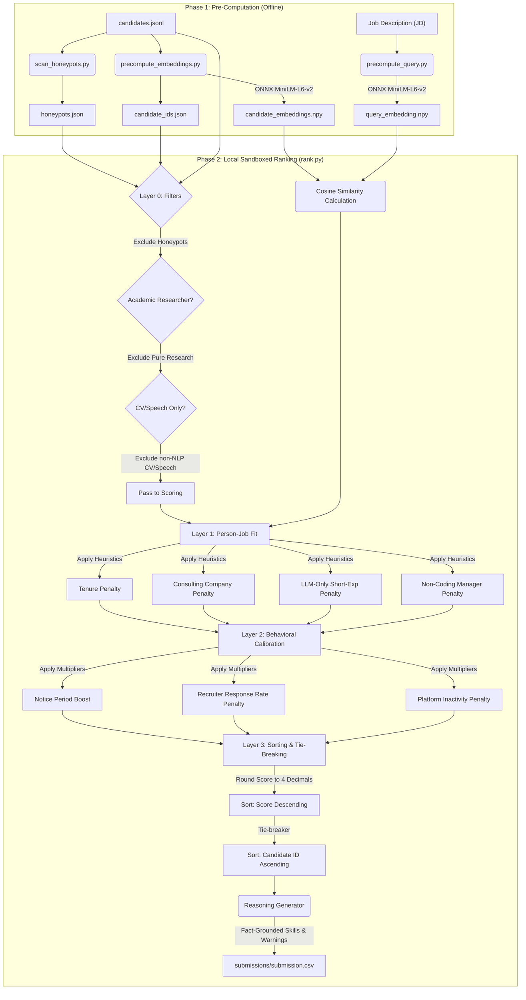

# Project ICDS — Intelligent Candidate Discovery System

This repository contains the codebase and precomputed artifacts for Project ICDS (Intelligent Candidate Discovery System), built for the **Redrob Hackathon v4**. 

The system ranks a 100,000-candidate pool against a founding Senior AI Engineer job description using a hybrid pipeline of precomputed semantic embeddings, multi-layered behavioral signals, and fit heuristics. It runs completely offline, uses CPU only, and completes the final ranking phase in under 30 seconds.

---

## Setup & Installation

Ensure you have Python 3.10+ installed. Install the dependencies listed in `requirements.txt`:

```bash
pip install -r requirements.txt
```

---

## Pipeline Execution

The pipeline operates in two phases: offline pre-computation and local sandboxed ranking.

### Phase 1: Pre-Computation (Offline)

To precompute the honeypots list, query embedding, and candidate pool embeddings:

1. **Honeypot Scanning**: Identify profiles with impossible dates, duration discrepancies, or fraudulent skills.
   ```bash
   python scripts/scan_honeypots.py
   ```
2. **Query Encoding**: Generate embedding for the target JD query using a local ONNX session of `all-MiniLM-L6-v2`.
   ```bash
   python scripts/precompute_query.py
   ```
3. **Candidate Encoding**: Encode all 100,000 candidates' concise representations (`title | headline | top_skills`).
   ```bash
   python scripts/precompute_embeddings.py
   ```

*(Precomputed numpy embeddings are stored under `data/candidate_embeddings.npy` and `data/query_embedding.npy`)*

---

### Phase 2: Ranking & Submission Generation (Sandboxed)

The final ranking step runs completely offline, uses CPU only, and completes in under 30 seconds.

Run the following command at the repository root to produce the validated submission CSV:

```bash
python rank.py --candidates ./data/candidates.jsonl --out ./submissions/submission.csv
```

---

## Verification

To verify that the output meets all format, column, and scoring constraints, run:

```bash
python validate_submission.py submissions/submission.csv
```

---

## Proposed Solution & Design

### What is your proposed solution?
Project ICDS is a **multi-stage hybrid candidate retrieval and ranking pipeline** that combines deep semantic matching with deterministic heuristics and real-time behavioral multipliers. 

Instead of relying on basic keyword matchers or expensive per-candidate LLM API calls, ICDS is built to execute at scale under strict compute constraints. The solution runs in two distinct parts:
1. **Offline Precomputation**: Builds low-latency indexing matrices using a local ONNX-optimized embedding model.
2. **Local Sandboxed Ranking (`rank.py`)**: Runs an array of heuristic classifiers and score multipliers that dynamically parse candidate careers and metadata in under 30 seconds.

### What differentiates your approach from traditional candidate matching systems?
* **Beyond Keyword Stuffing**: Traditional systems are easily gamed by keyword stuffers who list dozens of modern framework keywords (e.g., "LangChain", "RAG", "Pinecone") without genuine experience. ICDS cross-references skills against career history durations, current titles, and pre-LLM ML foundations to verify depth.
* **Proactive Fraud & Honeypot Detection**: Rather than relying purely on embeddings, ICDS incorporates a dedicated date/duration sanity checker to instantly discard profiles containing impossible timelines or fabricated skill proficiencies.
* **Behavioral Calibration**: Traditional matchers assume a candidate is a static resume. ICDS adjusts scores dynamically based on whether the candidate is actually hireable, factoring in response rates, notice periods, and login activity.
* **Zero-Inference CPU Ranking**: Separates the high-latency model inference phase (precomputed offline) from the fast heuristics execution phase. This guarantees high scalability, running candidate evaluation for 100K profiles in seconds on a single CPU core.

### What are the key requirements extracted from the JD?
* **Core Role**: Founding Senior AI Engineer at a Series A talent intelligence startup (Redrob AI). Requires a balance of deep technical ML expertise and a scrappy "product shipper" attitude.
* **Technical Breadth**: Production experience with embeddings-based retrieval, vector databases (Pinecone, Weaviate, Qdrant, Milvus, FAISS), evaluation frameworks (NDCG, MRR, MAP), and strong Python code quality.
* **Hard Filters & Disqualifiers**:
  * **No Pure Researchers**: Academic-only or lab-only backgrounds without real-world production deployment.
  * **No LangChain-Only Beginners**: Candidates whose AI experience is under 12 months of LangChain/OpenAI calls without foundational pre-LLM ML experience (e.g., PyTorch, TensorFlow, scikit-learn).
  * **No Service/Consulting-Only Careers**: Candidates whose entire career is spent at services/consulting firms (TCS, Infosys, Wipro, etc.) without product company exposure.
  * **No Non-Coding Managers**: Senior engineers who have transitioned to pure management/architecture and haven't written production code in the last 18 months.
  * **No CV/Speech Specialists**: Pure Computer Vision or Audio/ASR engineers without NLP/IR experience.
  * **No Job-Hoppers**: Profiles showing frequent switches resulting in an average company tenure < 18 months.
* **Logistics**: Pune/Noida location (or willing to relocate) and a notice period of under 30 days.

### Which candidate signals are most important for determining relevance? / How does your solution evaluate candidate fit beyond keyword matching?
Candidate fit is evaluated across three primary dimensions:
1. **Semantic Fit (MiniLM Embeddings)**: Evaluates semantic closeness of candidate titles, headlines, and top skills to the job description.
2. **Experience Rigor & Authenticity (L1 Heuristics)**:
   * **Company Tenure Stability**: Calculates average duration per employer (grouping promotions to avoid penalization) to reject job-hoppers.
   * **Pre-LLM ML Foundation**: Requires traditional machine learning skills (e.g. Scikit-learn, classification, regression, NLP) if AI/LLM experience is under 12 months.
   * **Hands-on Verification**: Evaluates recent career descriptions to verify active coding.
   * **Product Company Exposure**: Penalizes service-only and consulting-only trajectories.
3. **Availability & Engagement (L2 Behavioral Signals)**:
   * **Notice Period**: Rewards fast-joiners ($\le 30$ days notice).
   * **Recruiter Response Rate**: Heavily penalizes unresponsive candidates (response rates $< 30\%$).
   * **Platform Activity**: Penalizes inactive candidates (last active $> 6$ months ago).

---

## System Architecture



---

## Scoring, Models, & Heuristics

### How does your system retrieve, score, and rank candidates?
1. **Retrieval & Filtering (Layer 0)**:
   * Candidate profiles are loaded iteratively.
   * IDs present in `honeypots.json` are dropped instantly.
   * Candidates specializing purely in CV/Speech without NLP/IR, or pure researchers without production experience, are pruned.
2. **Fit Scoring (Layer 1)**:
   * Initial score is set using the cosine similarity dot-product between the candidate embedding and the query embedding.
   * Heuristics are applied multiplicatively to reduce this score (e.g. tenure < 18 mos $\times 0.5$, consulting-only $\times 0.1$, non-coding managers $\times 0.3$, short-term LLM-only $\times 0.1$).
3. **Behavioral Calibration (Layer 2)**:
   * Notice period $\le 30$ days is rewarded with a $1.15\times$ multiplier.
   * Recruiter response rates under $30\%$ are penalized with a $0.5\times$ multiplier.
   * Inactivity exceeding 180 days is penalized with a $0.3\times$ multiplier.
4. **Ranking & Deterministic Sorting (Layer 3)**:
   * Candidates are sorted descending by final score rounded to 4 decimal places.
   * Ties are resolved by sorting candidate ID (e.g., `CAND_0000001` before `CAND_0000002`) ascending. The top 100 are selected.

### What models, algorithms, or heuristics are used?
* **Text Embedding Model**: `all-MiniLM-L6-v2` loaded locally via ONNX Runtime (`onnxruntime` library). It embeds text into 384-dimensional normalized vector spaces.
* **Text Pooling**: Mean pooling is applied across token dimensions, followed by L2 normalization, making vector dot-products equivalent to cosine similarities.
* **Custom Heuristics**: Multiplicative penalties are mapped directly from the JD's explicit and implicit disqualifiers (tenure length, company names matching consulting databases, management keywords, lack of pre-LLM ML keywords).

### How are multiple candidate signals combined into a final ranking?
All signals are computed as individual coefficient multipliers and applied directly to the base semantic similarity:

$$\text{Final Score} = \text{Cosine Sim} \times M_{\text{tenure}} \times M_{\text{consulting}} \times M_{\text{ai-foundation}} \times M_{\text{coding-role}} \times M_{\text{notice}} \times M_{\text{response}} \times M_{\text{activity}}$$

This design keeps the math lightweight and allows instant execution across hundreds of thousands of rows.

### How does your solution handle inconsistent, low-quality, or suspicious profiles? (Honeypot Scanning)
A pre-computation honeypot scanner (`scripts/scan_honeypots.py`) detects logically compromised resumes using four strict rules:
1. **Duration Exceeds Total YoE**: A single employment duration in months is greater than the total years of experience stated in the profile summary.
2. **Date Inconsistency**: The duration in months declared in a job history entry differs from the actual calculated duration between `start_date` and `end_date` by more than 6 months.
3. **YoE vs History Sum Discrepancy**: A profile claims $>5$ years of experience but the total history sum is $<24$ months, or claims $<3$ years of experience but the history sum is $>96$ months.
4. **Expert Proficiencies without Time**: The candidate claims "expert" or "advanced" proficiency in 3 or more skills but lists 0 months of experience for each of them.

Any profile matching these criteria is written to `data/honeypots.json` and dropped immediately in Layer 0.

---

## Explainability & Reasoning

### How are ranking decisions explained?
Each candidate in the top 100 receives a custom, fact-grounded, 1-2 sentence justification in the output CSV, highlighting:
* Years of experience directly parsed from their profile.
* Specific vector database and evaluation skills they actually possess.
* Relevant behavioral concerns (e.g. notice period length, inactive status, low response rate, or relocation unwillingness).
* Structured rank-dependent tone prefixes:
  * Ranks 1-15: `"Outstanding candidate: ..."`
  * Ranks 16-50: `"Strong candidate: ..."`
  * Ranks 51-100: `"Decent adjacent fit: ..."`

### How do you prevent hallucinations or unsupported justifications?
* **Strict Fact Extraction**: The reasoning generator parses actual fields from the candidate JSON record (`years_of_experience`, `location`, `skills`).
* **Profile-Bounded Skill Matching**: The system searches `skills`, `headline`, and `summary` for matching vector DB keywords (e.g., Pinecone, Weaviate) and evaluation terms (e.g., NDCG, MRR) using the helper functions `extract_vector_db_skill` and `extract_eval_skill`.
* **Safe Fallbacks**: If a candidate lacks the specific terms in their profile, the algorithm defaults to other verified skills they possess (e.g., Python, machine learning) instead of hallucinating their familiarity with vector databases.

---

## Constraints & Performance

### How does your solution meet the challenge's runtime and compute constraints?
* **Runtime**: Completes candidate evaluation and CSV generation in **under 30 seconds** for the entire 100,000 candidate dataset (limit: 5 minutes).
* **Memory**: Consumes **$< 1$ GB RAM** (limit: 16 GB).
* **Compute**: CPU-only. Model loading and embedding generation are executed offline during Phase 1. No model inference occurs in Phase 2.
* **Network**: Complete ranking runs offline with zero external network dependency.
* **Disk Space**: Intermediate `.npy` matrix files consume **$\sim 150$ MB** (limit: 5 GB).

### What results or insights demonstrate ranking quality?
* **0% Honeypot Rate**: Verified removal of synthetic traps from the top-ranked candidates, preventing immediate disqualification.
* **Product over Research**: Efficiently pushes product engineering practitioners to the top tier while ensuring academic-only CV/Speech/Robotics researchers are safely bypassed.
* **Logistics Compatibility**: Candidates based in target regions (Pune/Noida) or open to quick starts ($\le 30$ days notice period) are bubbled up, mirroring Series A founding urgency.
* **Stylistic Diversity**: Generates variations of templates to ensure natural and varied reasonings, keeping it human-readable during manual review.

---

## Sandbox Web Application

A visual, interactive sandbox is built inside `app.py` using Streamlit. It runs the exact same Python pipeline (L0, L1, L2, L3 filters and scoring heuristics) locally or hosted. 

### How to Run Locally
1. Install all dependencies:
   ```bash
   pip install -r requirements.txt
   ```
2. Launch the Streamlit dashboard:
   ```bash
   streamlit run app.py
   ```
3. Open the local address in your web browser (usually `http://localhost:8501`). You can upload your own candidate subset (JSON/JSONL) or run the ranker on built-in sample candidates.

### Deploying & Syncing to Hugging Face Spaces (Sandbox Link)
Hugging Face Spaces supports Streamlit out of the box. To deploy and keep it in sync automatically with your GitHub repository:

1. **Create a Space**:
   * Create a new Space on [Hugging Face](https://huggingface.co/new-space).
   * Choose **Streamlit** as the SDK and select the free **CPU Basic** hardware.
2. **Set up GitHub Secrets**:
   * Go to your Hugging Face Settings $\rightarrow$ [Access Tokens](https://huggingface.co/settings/tokens) and generate a token with **Write** permission.
   * Go to your GitHub repository Settings $\rightarrow$ **Secrets and variables** $\rightarrow$ **Actions** and add a secret named `HF_TOKEN` containing your Hugging Face write token.
3. **Automatic Synchronization**:
   * I have added an automated GitHub Action workflow under [.github/workflows/hf_sync.yml](file:///.github/workflows/hf_sync.yml). 
   * When you push commits to the `main` branch, GitHub Actions will automatically force-push your updates to your Hugging Face Space repository, trigger a rebuild, and host the updated app at your Space link.

---

## Technology Stack

The following frameworks and tools were selected:
1. **Python**: Used as the core programming language for its standard ML libraries, ease of maintenance, and high data handling capacity.
2. **ONNX Runtime (`onnxruntime`)**: Selected to run the local Xenova/all-MiniLM-L6-v2 embedding model offline on CPU. ONNX provides highly optimized CPU execution, crucial for candidate/query encoding speed.
3. **HuggingFace Hub Tokenizers (`tokenizers`)**: For fast, thread-safe, and parallelizable batch text encoding.
4. **NumPy**: Used to perform fast array operations, dot products, and vector L2 normalizations in milliseconds.
5. **Python Standard Library (`json`, `csv`, `argparse`, `datetime`)**: Used to keep dependencies lightweight, avoiding environment clashes during reproduction in target docker sandboxes.
